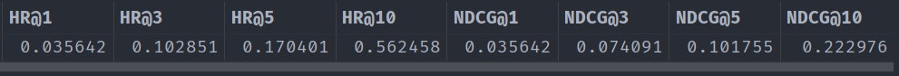
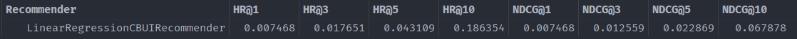

# Recommender Systems Project 1

### Project overview

The project is made for Recommender Systems classes at Adam Mickieiwcz University. It uses hotel data connected to users eg. how many people are booked for stay, how much did user pay for the night or did the user stayed on the weekend.
Then, using different recommenders (Linear Regression or Random Forest), tries to beat Amazon Recommender in recommending different hotel features.

### How to run

1. Install [Anaconda](https://www.anaconda.com/products/individual) with Python 3.8.
2. Install [Git](https://git-scm.com/downloads).
3. Clone [this repository](https://github.com/jakuubs/Recommender-Systems.git):
    <pre>git clone https://github.com/jakuubs/Recommender-Systems.git</pre>
4. Prepare your conda environment (instructions given for Windows, but it should be similar on other systems):

    1. Open Anaconda Prompt as administrator.
    2. Make sure you're in the repository main folder. Run the following command:
            <pre>conda env create --name recommender -f environment.yml</pre>
        You can replace *recommender* with your own environment name.
        You may need to install a C++ compiler to install certain packages.
        
        **NOTE** 
        There might be some problems with package <u><i>hyperopt</i></u>. In such case you can install the package manually with <i>conda</i> or <i>pip</i> and it should work perfectly.
        
5. In Command Prompt open the repository folder and activate just created environment with the following command:
    <pre>conda activate recommender</pre>
6. In Command Prompt type:
    <pre>jupyter notebook</pre>
7. In Jupyter Notebook open <i>project_1_recommender_and_evaluation.ipynb</i>.
8. Run first 5 cells with run button or hit <i>shift+enter</i>. This should prepare the recommender to predict user scores.
9. Run next 3 cells to fit, recommend and display the results in a table:
    
10. (Optional) Run some tuning functions (next 6 cells) and compare the results using different recommenders.
11. In the last 3 cells you compare the recommender with Amazon Recommender:
    

### Additional thoughts
1. The best results were accomplished using RandomForestCBUIRecommender and the final results look like this:
    
   LinearRegressionCBUIRecommender has significantly worse results in this case:
    
2. I tried different user preparation functions:
    1. One hot encoding version results were not really satisfying (The best hit ratio was about 0.02 but that might also be the fault of the picked features).
    2. Probability version also has some flaws and the results did not get much better than in the one hot encoding version.
    3. The best version calculates the averages for every user in columns with buckets (To get back the numerical values, I used the preprocessed data).

   I left all three versions in the user preparation cell, however I recommend using the one with averages.
